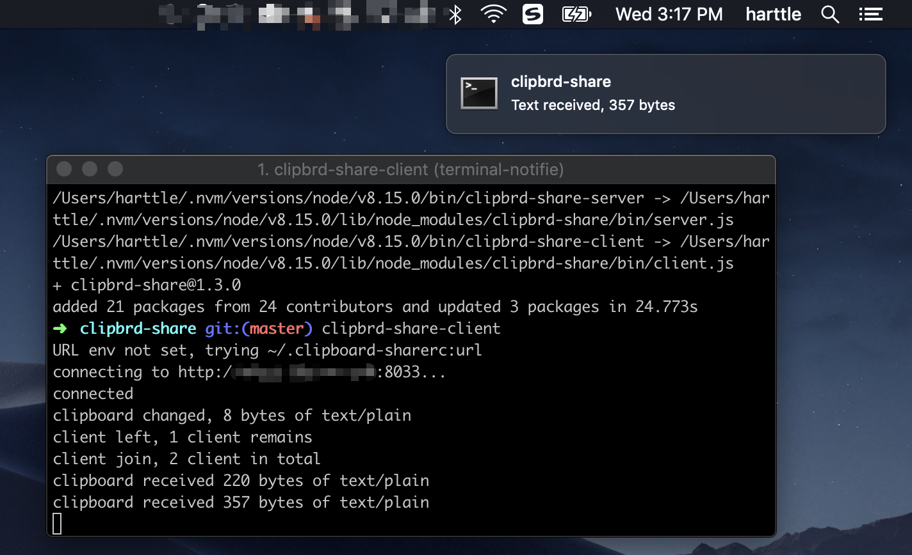
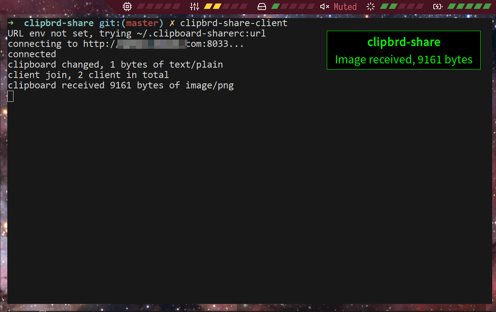

## Features

* Multiple platforms: OSX, Linux
* Multiple MIMEs: text/plain, image/png
* Desktop notifycation integrated





## Dependencies

**OSX**: all dependencies are bundled into this repo, no additional dependencies.

**Linux**：[xclip](https://www.archlinux.org/packages/extra/x86_64/xclip/)

```bash
pacman -S xclip
```

## Usage

Install:

```bash
npm i -g clipbrd-share
```

Start the server:

```bash
PORT=3000 clipbrd-share-server
```

Start the client on another machine:

```bash
URL=http://example.com:3000 clipbrd-share-client
```

## Thanks

* Image copy/paste binaries are built from: https://github.com/moicci/pngpaste
* Desktop notifications are provided by: https://www.npmjs.com/package/node-notifier
